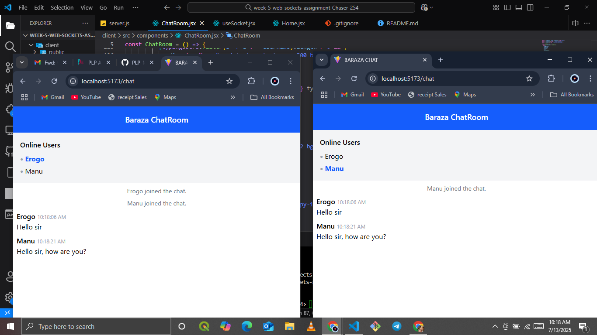

ChatRoom

A real-time, multi-user chat application built with **React**, **Socket.IO**, and **Node.js**.  
Users can join the chatroom, see who’s online, send messages, see typing indicators, react to messages, and log out.

chat/
├── client/                 # React front-end
│   ├── public/             # Static files
│   ├── src/                # React source code
│   │   ├── components/     # UI components
│   │   ├── context/        # React context providers
│   │   ├── hooks/          # Custom React hooks
│   │   ├── pages/          # Page components
│   │   ├── socket/         # Socket.io client setup
│   │   └── App.jsx         # Main application component
│   └── package.json        # Client dependencies
├── server/                 # Node.js back-end
│   ├── server.js           # Main server file
│   └── package.json        # Server dependencies
└── README.md               # Project documentation
## Setup & Run

### Clone the repo
```bash
git clone https://github.com/your-username/baraza-chatroom.git
cd baraza-chatroom
```

###  Install dependencies

#### Backend:
```bash
cd server
npm install
```

#### Frontend:
```bash
cd ../client
npm install
```

---

##  Run the App

### Start backend server
```bash
cd server
node server.js
```
Backend runs at:  
🌐 `http://localhost:5000`

### Start frontend
```bash
cd client
npm run dev
```
Frontend runs at:  
🌐 `http://localhost:5173`

---

## 🌟 Usage

✅ Open `http://localhost:5173` in your browser.  
✅ Enter your username and join the chat.  
✅ See who is online.  
✅ Start typing to show typing indicator.  
✅ React to messages with 👍 or ❤️.  
✅ Logout anytime.

---

## 🎨 Screenshots
